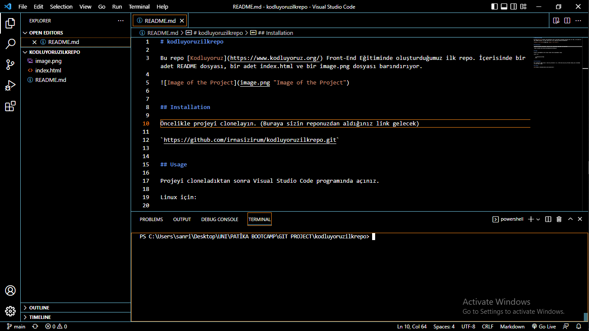

# kodluyoruzilkrepo

Bu repo [Kodluyoruz](https://www.kodluyoruz.org/) Front-End Eğitiminde oluşturduğumuz ilk repo. İçerisinde bir adet README dosyası, bir adet index.html ve bir image.png dosyası barındırıyor.




## Installation

Öncelikle projeyi clonelayın. (Buraya sizin reponuzdan aldığınız link gelecek)

`https://github.com/irnasizirum/kodluyoruzilkrepo.git`


## Usage

Projeyi cloneladıktan sonra Visual Studio Code programında açınız.

Linux için:  
  
```  
    cd kodluyoruzilkrepo  
    code .
```


## Contributing

Pull requestler kabul edilir. Büyük değişiklikler için, lütfen önce neyi değiştirmek istediğinizi tartışmak için bir konu açınız.

## Patika Linkim

[Patika Linkim](https://app.patika.dev/irnasizirum)

## License

[MIT](https://choosealicense.com/licenses/mit/)